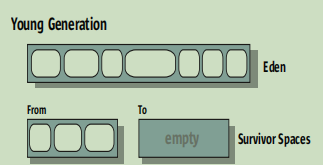

- [学习笔记](#----)
    + [homework](#homework)
      - [lesson_3_1](#lesson-3-1)
      - [lesson_3_2](#lesson-3-2)
      - [lesson_4_1](#lesson-4-1)
      - [lesson_4_2](#lesson-4-2)
    + [hotspot vm gc整理](#hotspot-vm-gc--)
      - [回收设计的选择](#-------)
      - [各类垃圾回收器](#-------)
        * [代的设计](#----)
        * [具体的回收器](#------)

# 学习笔记  
### homework  
#### lesson_3_1  
* 串行gc  
-XX:+UseSerialGC -Xms512m -Xmx512m -Xloggc:serial.gc.log -XX:+PrintGCDetails -XX:+PrintGCDateStamps  
输出：14473
> [GC (Allocation Failure) 2021-01-19T23:19:30.537+0800: 0.149: [DefNew: 139648K->17472K(157248K), 0.0160006 secs] 139648K->38817K(506816K), 0.0160984 secs] [Times: user=0.02 sys=0.00, real=0.02 secs]  
> 默认比例下年轻代的大小157248K，堆的最大值506816K ！=512m？？？，发生了一次young gc  
> [GC (Allocation Failure) 2021-01-19T23:19:30.775+0800: 0.387: [DefNew: 157246K->157246K(157248K), 0.0000097 secs]2021-01-19T23:19:30.775+0800: 0.387: [Tenured: 315567K->266185K(349568K), 0.0225954 secs] 472814K->266185K(506816K), [Metaspace: 3293K->3293K(1056768K)], 0.0226505 secs] [Times: user=0.03 sys=0.00, real=0.02 secs]  
> 可以看到young已经满了，没有回收掉，老年代发生了回收  
> [Full GC (Allocation Failure) 2021-01-19T23:19:31.392+0800: 1.004: [Tenured: 349535K->349545K(349568K), 0.0299755 secs] 506750K->383332K(506816K), [Metaspace: 3293K->3293K(1056768K)], 0.0300135 secs] [Times: user=0.03 sys=0.00, real=0.03 secs]  
> 后期可以看到在持续的full gc，因为老年代持续爆满  

* 并行gc  
-XX:+UseParallelGC -Xms512m -Xmx512m -Xloggc:parallel.gc.log -XX:+PrintGCDetails -XX:+PrintGCDateStamps  
输出：11641  
-XX:+UseParallelOldGC -Xms512m -Xmx512m -Xloggc:parallelOld.gc.log -XX:+PrintGCDetails -XX:+PrintGCDateStamps  
输出：11415  
-XX:+UseParallelGC -XX:+UseParallelOldGC -Xms512m -Xmx512m -Xloggc:parallelwithpold.gc.log -XX:+PrintGCDetails -XX:+PrintGCDateStamps  
输出：11797  
-XX:+UseParallelGC -XX:-UseParallelOldGC -Xms512m -Xmx512m -Xloggc:parallelwithoutpo.gc.log -XX:+PrintGCDetails -XX:+PrintGCDateStamps    
输出：11607  

> UseParallelOldGC是UseParallelGC的进化版，也叫“Parallel Compacting Collector”，是在并行gc基础上，对老年代同样也使用了并行地回收算法  
> 
>  
>
* 4g堆情况下串行、并行地对比  
-XX:+UseSerialGC -Xms4G -Xmx4G -Xloggc:serial4g.gc.log -XX:+PrintGCDetails -XX:+PrintGCDateStamps  
输出：16540  
-XX:+UseParallelGC -Xms4G -Xmx4G -Xloggc:parallel4g.gc.log -XX:+PrintGCDetails -XX:+PrintGCDateStamps  
输出：25266  
> 放大的堆的容量，并行回收的效率显现出来了，并行地情况下回收效率高，应用的吞吐大。机器的核心数足够，并行不会导致反向的优化
* CMS  
-XX:+UseConcMarkSweepGC -Xms512m -Xmx512m -Xloggc:cms.gc.log -XX:+PrintGCDetails -XX:+PrintGCDateStamps  
输出：13282  
> [GC (Allocation Failure) 2021-01-20T20:40:57.697+0800: 0.257: [ParNew: 139690K->17471K(157248K), 0.0055021 secs] 139690K->45171K(506816K), 0.0062084 secs] [Times: user=0.08 sys=0.11, real=0.01 secs]  
  [GC (CMS Initial Mark) [1 CMS-initial-mark: 213156K(349568K)] 231362K(506816K), 0.0002583 secs] [Times: user=0.00 sys=0.00, real=0.00 secs] 
  [CMS-concurrent-mark-start]  
  [CMS-concurrent-mark: 0.001/0.001 secs] [Times: user=0.00 sys=0.00, real=0.00 secs]  
  [CMS-concurrent-preclean-start]  
  [CMS-concurrent-preclean: 0.000/0.000 secs] [Times: user=0.00 sys=0.00, real=0.00 secs]  
  [CMS-concurrent-abortable-preclean-start]  
  [GC (Allocation Failure) 2021-01-20T20:40:57.836+0800: 0.396: [ParNew: 157245K->17471K(157248K), 0.0195496 secs] 370402K->273612K(506816K), 0.0195916 secs] [Times: user=0.20 sys=0.00, real=0.02 secs]  
  [GC (Allocation Failure) 2021-01-20T20:40:57.869+0800: 0.430: [ParNew: 157247K->17469K(157248K), 0.0217683 secs] 413388K->319006K(506816K), 0.0218078 secs] [Times: user=0.28 sys=0.06, real=0.02 secs]  
  [GC (Allocation Failure) 2021-01-20T20:40:57.904+0800: 0.465: [ParNew: 157245K->157245K(157248K), 0.0000387 secs]2021-01-20T20:40:57.904+0800: 0.465: [CMS2021-01-20T20:40:57.904+0800: 0.465: [CMS-concurrent-abortable-preclean: 0.002/0.079 secs] [Times: user=0.55 sys=0.06, real=0.08 secs] 
   (concurrent mode failure): 301537K->250851K(349568K), 0.0321722 secs] 458782K->250851K(506816K), [Metaspace: 3293K->3293K(1056768K)], 0.0325231 secs] [Times: user=0.03 sys=0.00, real=0.03 secs]  
> 持续几个young gc后，开始old的回收，并且提示了回收的时候回收行为和应用本身并发执行失败了。。
* G1
-XX:+UseG1GC -Xms512m -Xmx512m -Xloggc:g1.gc.log -XX:+PrintGCDetails -XX:+PrintGCDateStamps  
输出：12737  
#### lesson_3_2 
1111
#### lesson_4_1  
213
#### lesson_4_2  
123
### hotspot vm gc整理  
#### 回收设计的选择  
> 串行、并行  
>> 串行：即垃圾回收任务是由一个cpu核心全部处理  
>> 并行：垃圾回收任务是会被拆分成若干部分，由多个核心同时处理  
>
>并发、stw  
>> stw：当stw类型的垃圾回收进行时，业务应用会被暂停  
>> 并发：一个或多个垃圾回收任务伴随着业务应用同时进行  
>> 一般来说，并发的垃圾回收器，进行绝大部分的垃圾回收工作是与业务应用并发的进行，同时也会有很少部分的情况下需要stw  
>> 复杂度：并发>stw，因为stw的情况下，对象间的关系也不会变了  
>> 长暂停：并发<stw，因为是多个垃圾回收器并发进行的，更快，但每个垃圾回收器会更复杂，更偏好较大的堆  
>
> 压缩、非压缩、拷贝  
>> 压缩：即将存活对象挪到一起，之外的内存就都变得可用  
>> 非压缩：即原地释放对象，不会把存活对象挪到一起，更快，但是会造成碎片化  
>> 拷贝：将存活对象转移到一个不同的、可以认为是空的内存空间中，拷贝完成后，原地址就可以被当做可用的空间，代价是拷贝行为的花销与额外堆空间的花销  
#### 各类垃圾回收器  
##### 代的设计  

  

* new的对象都是在Eden里创建的，当创建的对象过大时也有可能直接在old代创建

##### 具体的回收器  

* 串行：垃圾回收的情况下业务应用汇stw，而且还是单线程的进行回收   
  * 年轻代：当to空间是满的情况下，eden和from中存活的对象会直接晋升到old，即会无视存活几次young gc才可以晋升old的条件  
  * 老年代：老年代的回收的操作是：标记存活对象，找到垃圾对象，将存活对象整理到一起，使得地址连续  
* 并行：多核cpu的场景下
  * 年轻代：和串行类似，只不过是通过多核cpu并行处理提高性能
  * 老年代：和串行gc老年代的一致
* 并行压缩：并行gc的升级版，jdk8里头用的并行gc就是这个gc了  
  * 年轻代：和并行类似  
  * 老年代：优化了并行gc中老年代的算法，分三步：标记-总结-压缩，也还是stw，但是并行化了  
* CMS:强调gc和业务应用同时进行，旨在减少gc回收导致的暂停，进而加快相应的时间
  * 年轻代：和并行gc一致  
  * 老年代：强调gc和业务应用同时进行，但是也会有短暂的stw的阶段。**回收是原地释放的，即non-compacting。造成可用老年代空间的不连续，碎片化。更偏好大的堆空间**  
* G1:适用于服务端，偏向于多核、大内存的机器，旨在实现短暂停，同时高吞吐的目标。gc过程与业务应用同时进行。堆被划分为等大小的区域  
  * 在G1中的老年代年轻代还是存在的，但是已经是逻辑上的概念了。即代的各区之间的内存不连续了。  
  * 
    * 

G1垃圾回收器相关的虚拟机参数：  

|参数名|作用|   
| :-----| :--- |  
|-XX:+UseG1GC|启动开关|  
|-XX:MaxGCPauseMillis=n|期望的最大gc时间|  
|-XX:InitiatingHeapOccupancyPercent=n|开始gc时全部堆空间的占用比|  
|-XX:NewRatio=n|尽管堆是均分的，还是存在年轻代的比例|  
|-XX:SurvivorRatio=n|eden和from、to的比例|  
|-XX:MaxTenuringThreshold=n|经过多少次ygc，对象晋升老年代|  
|-XX:ParallelGCThreads=n|并行阶段gc的线程数量TODO|  
|-XX:ConcGCThreads=n|并发回收的垃圾回收线程数TODO|  
|-XX:G1ReservePercent=n|堆的保留空间，用于减少晋升失败的可能性，即留一块缓冲区域用于缓解堆空间紧张时发生晋升失败的问题|  
|-XX:G1HeapRegionSize=n|堆每个分区的大小|  